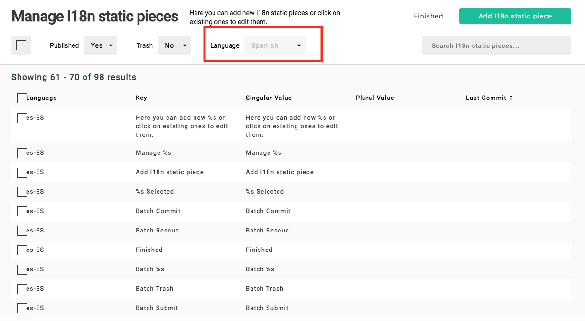

<a id="contents"></a>

# Apostrophe i18n static

1. [Installation](#1)<br>
2. [Configuration](#2)<br>
3. [Usage in production](#3)<br>
4. [Usage with apostrophe-workflow](#4)<br>

This module adds editable pieces for translation through i18n to an Apostrophe project.

:warning: **Warning!!!** :warning:

It is intendend to localize static text in templates i.e text wrapped with `__("...")`, not localize editable content. If your goal is content localization, you should use the [Apostrophe workflow module](https://github.com/apostrophecms/apostrophe-workflow) instead.

I18n static pieces are excluded from apostrophe-workflow. To use both `apostrophe-i18n-static` and `apostrophe-workflow`, see [Usage with apostrophe-workflow](#4)

For static text localization, you are in the right place.

---

Pieces are edited in the module `apostrophe-i18n-static`. Then, JSON files are generated for the i18n module used in Apostrophe.

This will add an entry in the admin bar "I18n static" and pieces will have a schema with:
- language
- key
- value
- optional plural value matching i18n module


The first time a template containing a new string to translate through `__("...")` is rendered, the piece is created in the database. When the value of this piece is edited, the matching JSON file is recreated. Therefore, do **NOT** edit directly the JSON files.

<a id="1"></a>

## 1 Installation [&#x2B06;](#contents)

`npm i apostrophe-i18n-static`

<a id="2"></a>


## 2 Configuration [&#x2B06;](#contents)

The following options are mandatory:
- locales to edit, in an array with `label` and `value` fields
- a default locale (one of the locales)

```js
// app.js

require('apostrophe')({
  shortName: 'name-of-project',
  modules: {
    'apostrophe-i18n-static': {
      defaultLocale: 'en-US',
      locales: [
        {
          label: 'German',
          value: 'de-DE',
        },
        {
          label: 'English',
          value: 'en-US',
        },
        {
          label: 'Spanish',
          value: 'es-ES',
        },
        {
          label: 'French',
          value: 'fr-FR',
        }
      ]
    }
  }
})
```
This will create the corresponding JSON files in the `locales` folder of the project (or the `localesDir` defined in `apostrophe-i18n` module). The format of the locales can be anything (`en-US` in this example, but could have been `en` or other format fitting your needs).

Other options are:
- `disabledKey`: default `false`. When `true`, it will render the `key` field as "disabled" to inform users the key should not be modified.
- `autoReload`: default `true`. When `false`, it will not reload JSON files when a translation piece is edited.
- `generateAtStartup`: default `true`. When `false`, JSON files are not generated automatically at startup.
- `useWorkflowLocales`: default `false`. If `true`, it uses `apostrophe-workflow` `locales` array (must have installed and configured `apostrophe-workflow` before - see 4. [Usage with apostrophe-workflow](#4)). In this case, the `locales` array from `apostrophe-i18n-static` module is not used. This option might be an object, containing a sub-option: `displayCurrentLocale: true`. This locks the locale displayed in the "list" modal of apostrophe-i18n-static. For example, if one is on `es-ES` locale, they would only see spanish translations, and would not be able to edit another locale's translation (unless changing locale in apostrophe-workflow).

- `objectNotation`: default `false`. As in `i18n`, when `true`, the separator will be `.`. Otherwise, it will take `objectNotation` value. For example, `objectNotation: '-'` will convert `obj-with-deep-val` into

```js
obj: {
  with: {
    deep: {
      val: 'obj-with-deep-val'
    }
  }
}
```

This `objectNotation` option enables default values too.

For example, with `objectNotation: true`, the string `__('obj.with.deep.val:nested value')` in a template will be converted into the JSON file as

```js
obj: {
  with: {
    deep: {
      val: 'nested value'
    }
  }
}
```

Be aware i18n catches every `__("")` key from Apostrophe templates, even the ones from Apostrophe core interface, that is to say every wording in modals, buttons, labels... And dots are used often (e.g: "Search pieces..." in Apostrophe search bar). These dots will be interpreted as separator if `objectNotation` default is activated. Therefore, it is recommended to choose another separator. For example, `objectNotation: '-'` or `objectNotation: '*'` to avoid confusion.

Options from `apostrophe-i18n` module are taken into account, except `locales` and `defaultLocale`.

#### JSON files regeneration

By default, at every startup, JSON files are generated by extracting translations from the database. If this behavior does not fit one's need, it can be disabled by passing the option `generateAtStartup: false`. In this situation, the following Apostrophe tasks can be used when manual generation is needed:

- `node app apostrophe-i18n-static:reload --locale=xx` where `xx` is a valid i18n file name. It generates only the file for the specified locale.
- `node app apostrophe-i18n-static:reload-all` finds every locale and generate files (see list of files in `locales` directory).

<a id="3"></a>

### 3 Usage in production [&#x2B06;](#contents)

As explained above, JSON files should not be edited directly because the reloading of i18n files is made after a translation piece has been edited. To be more accurate, if there are 2 JSON files (for example `en.json` and `fr.json`), if an `apostrophe-i18n-static` piece is edited for the `en` locale, only the `en.json` file will be regenerated.

Also, at startup, all JSON files are regenerated automatically, based on the cache if it exists, otherwise from the database values (see [3.2 Performance](#3-2)).

<a id="3-1"></a>

### 3.1 Distributed system

This module has been designed to work with several running Apostrophe instances sharing the same DB (or a MongoDB sharded cluster). In a docker environnement, if a translation piece is edited on one instance, its JSON file is regenerated inside its container and a new random ID is stored into the DB. This way, the next request coming from the other instance will detect there was a change (due to the new random ID) and regenerate its JSON files too. As a consequence, translations are always up-to-date.

<a id="3-2"></a>

### 3.2 Performance

As a general idea, the regeneration of a file containing several hundred translations takes usually a few milliseconds. Every reload is measured and displayed on the standard output.

However, to be sure it scales smoothly, a cache strategy has been implemented. Every edition on a translation piece empties the cache for the edited locale. The next request reloads the JSON file from the database in this case. Otherwise, it is pulled from the cache (useful at startup).


<a id="4"></a>

### 4 Usage with apostrophe-workflow [&#x2B06;](#contents)

Example of project configuration using `apostrophe-i18n-static` and `apostrophe-workflow` together:

```js
// app.js
const locales = [
  {
    label: 'German',
    value: 'de-DE'
  },
  {
    label: 'English',
    value: 'en-US'
  },
  {
    label: 'Spanish',
    value: 'es-ES'
  },
  {
    label: 'French',
    value: 'fr-FR'
  }
];

const defaultLocale = 'fr-FR';

require('apostrophe')({
  shortName: 'apostrophe-test',
  modules: {
    'apostrophe-i18n-static': {
      defaultLocale,
      locales
    },
    'apostrophe-workflow': {
      alias: 'workflow',
      locales: locales.map(locale => ({ label: locale.label, name: locale.value })),
      defaultLocale
    }
  }
});
```

The displayed translations will be taken from current worflow locale. For example, if the user is on the `es-ES` (or `es-ES-draft`) locale according to apostrophe-worflow, translations coming from `es-ES.json` will be displayed.

In case of nested locales with apostrophe-workflow, apostrophe-i18n-static will still work. It just needs a flat structure.

```js
const defaultLocale = 'en-US';

const apos = require('apostrophe')({
  modules: {
    shortName: 'apostrophe-test',
    'apostrophe-i18n-static': {
      disabledKey: true,
      defaultLocale,
      locales: [
        {
          label: 'English',
          value: 'en-US'
        },
        {
          label: 'Spanish',
          value: 'es-ES'
        },
        {
          label: 'French',
          value: 'fr-FR'
        },
        {
          label: 'German',
          value: 'de-DE'
        },
        {
          label: 'Austrian',
          value: 'de-AT'
        },
        {
          label: 'Swiss',
          value: 'de-CH'
        }
      ]
    },
    'apostrophe-workflow': {
      alias: 'workflow',
      locales: [
        {
          label: 'Master',
          name: 'master',
          private: true,
          children: [
            {
              label: 'English',
              name: 'en-US'
            },
            {
              label: 'Spanish',
              name: 'es-ES'
            },
            {
              label: 'French',
              name: 'fr-FR'
            },
            {
              label: 'Germany',
              name: 'de-DE'
              children: [
                {
                  label: 'Austria',
                  name: 'de-AT'
                },
                {
                  label: 'Switzerland',
                  name: 'de-CH'
                }
              ]
            }
          ]
        }
      ],
      defaultLocale
    }
  }
});
```

It is important to have the same `defaultLocale`.

Or `apostrophe-i18n-static` can use the locales from `apostrophe-workflow` by using the option `useWorkflowLocales`:

```js
const apos = require('apostrophe')({
  modules: {
    shortName: 'apostrophe-test',
    'apostrophe-i18n-static': {
      defaultLocale: 'en-US',
      useWorkflowLocales: true
    },
    'apostrophe-workflow': {
      alias: 'workflow',
      defaultLocale: 'en-US',
      locales: [
        {
          label: 'Master',
          name: 'master',
          private: true,
          children: [
            {
              label: 'English',
              name: 'en-US',
            },
            {
              label: 'Spanish',
              name: 'es-ES',
            },
            {
              label: 'French',
              name: 'fr-FR',
            },
            {
              label: 'Germany',
              name: 'de-DE',
              children: [
                {
                  label: 'Austria',
                  name: 'de-AT'
                },
                {
                  label: 'Switzerland',
                  name: 'de-CH'
                }
              ]
            }
          ]
        }
      ]
    }
  }
});
```
