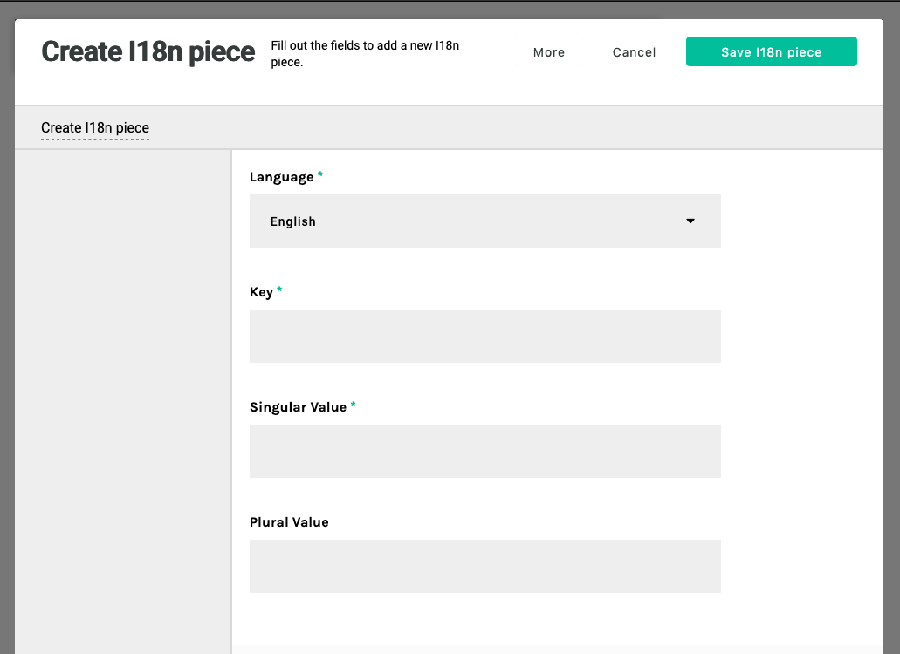

<a id="contents"></a>

# Apostrophe i18n static

1. [Installation](#1)<br>
2. [Configuration](#2)<br>
3. [Apostrophe tasks](#3)<br>

This module adds editable pieces for translation through i18n to an Apostrophe project.

:warning: **Warning!!!** :warning:

It is intendend to localize static text in templates i.e text wrapped with `__("...')`, not localize editable content. If your goal is content localization, you should use the [Apostrophe workflow module](https://github.com/apostrophecms/apostrophe-workflow) instead.

For static text localization, you are in the right place.

---

Pieces are edited in the module `apostrophe-i18n-static`. Then, JSON files are generated for the i18n module used in Apostrophe.

This will add an entry in the admin bar "I18n static" and pieces will have a schema with:
- language
- key
- value
- optional singular value matching i18n module



The first time a template containing a new string to translate through `__("...')` is rendered, the piece is created in the database. When the value of this piece is edited, the matching JSON file is recreated. Therefore, do **NOT** edit directly the JSON files.

<a id="1"></a>

## 1 Installation [&#x2B06;](#contents)

`npm i apostrophe-i18n-static`

<a id="2"></a>


## 2 Configuration [&#x2B06;](#contents)

The following options are mandatory:
- locales to edit, in an array with `label` and `value` fields
- a default locale (one of the locales)

```js
// app.js

require('apostrophe')({
  shortName: 'name-of-project',
  modules: {
    'apostrophe-i18n-static': {
      defaultLocale: 'en-US',
      locales: [
        {
          label: 'German',
          value: 'de-DE',
        },
        {
          label: 'English',
          value: 'en-US',
        },
        {
          label: 'Spanish',
          value: 'es-ES',
        },
        {
          label: 'French',
          value: 'fr-FR',
        }
      ]
    }
  }
})
```
This will create the corresponding JSON files in the `locales` folder of the project (or the `localesDir` defined in `apostrophe-i18n` module). The format of the locales can be anything (`en-US` in this example, but could have been `en` or other format fitting your needs).

Another option is `disabledKey`. By default, it is `false`. When `true`, it will render the `key` field as "disabled" to inform users the key should not be modified.

Options from `apostrophe-i18n` module are taken into account, except `locales` and `defaultLocale`.

<a id="3"></a>

### 3 Apostrophe tasks [&#x2B06;](#contents)

The reloading of i18n files is made after a translation piece has been edited. However, if files need to be regenerated, 2 tasks have been defined:

- `node app apostrophe-i18n-static:reload --locale=xx` where `xx` is a valid i18n file name. It generates only the file for the specified locale.
- `node app apostrophe-i18n-static:reload-all` finds every locale and generate files (see list of files in `locales` directory).
